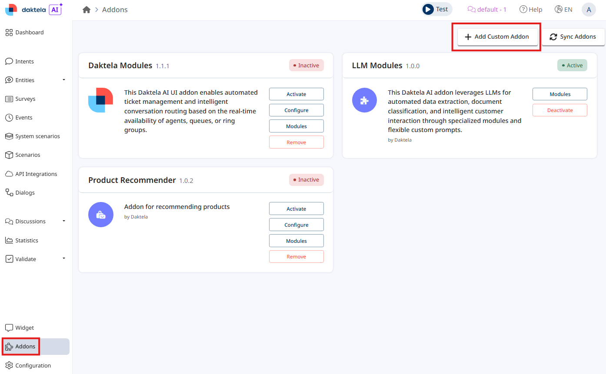
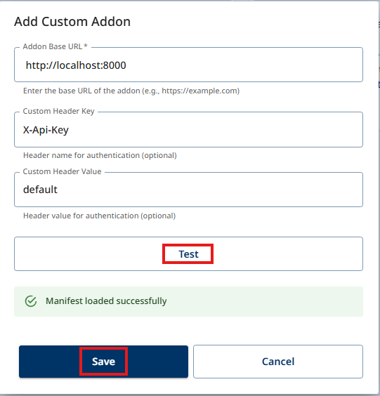
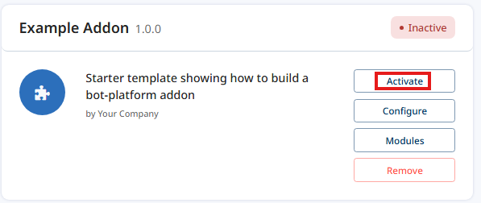

# Daktela AI Addon Template

A starter template for building **addons** for the **Daktela AI** bot platform.

An addon is a small HTTP service you host. It tells the platform what it can do, and the platform calls
it while a bot is talking to a customer. Addons add:

- **Modules** — the nodes a flow designer drags onto the canvas in the builder.
- **Integrations** — tools the AI agent can decide to call on its own.
- **A configuration page** — your own React UI, mounted inside the platform. Optional; see below.

This repository is a working addon with examples of each, plus a developer guide in [`docs/`](docs/).

## What it looks like when it works

Register your addon once, from **Addons → Add Custom Addon**:



Give it a URL and the API-key header — the **Test** button fetches your manifest, so you know it
works before you save:



Activate it. A `basic` addon activates straight away; a `full` one wants its configuration page
filled in first:



And your modules are in the builder, grouped under the `category` you declared, each with the title
and description from its manifest — no platform-side code, no registration step:


## Two profiles

Most addons are only modules. The configuration page is optional, so the template builds two ways:

| | `basic` | `full` |
|---|---|---|
| Flow-builder modules, integrations, dynamic lists | ✔ | ✔ |
| A React configuration page | — | ✔ |
| Needs Node to build | no | yes |
| Image | `docker/Dockerfile.basic` | `docker/Dockerfile` |

`ADDON_PROFILE=basic|full` switches between them, locally as well as in the image. Start with
`basic` unless an operator has something to configure.

---

## Five-minute quickstart

Requirements: [uv](https://docs.astral.sh/uv/) and Python 3.13+. No Docker, no database.

```bash
uv sync --all-extras
uv run uvicorn server.main:app --reload
```

Then:

```bash
curl -H "X-Api-Key: default" http://localhost:8000/manifest
```

You should see the addon's manifest listing six modules and one integration. Open
<http://localhost:8000/> for the interactive API docs.

That is the whole addon running. Next: [docs/01-quickstart.md](docs/01-quickstart.md).

To try it against a real Daktela AI instance, the platform has to be able to reach your addon. For a
quick experiment, tunnel your local port and register that URL
([chapter 3](docs/03-connect-to-bot-platform.md)):

```bash
cloudflared tunnel --url http://localhost:8000   # prints a public https:// URL, no account needed
```

That is a **development** shortcut only. A real addon runs on a server with its own address — see
[chapter 13](docs/13-deployment.md).

---

## What is in here

```
server/
  app.py                    the whole wiring, in one screen
  profile.py                basic or full - what this process exposes
  di.py                     where settings are stored (this is the database switch)
  settings/                 the one storage abstraction, with two implementations
  modules/catalog/          six example flow-builder modules
  integrations/catalog/     a tool the AI agent can call
  dynamic_lists/catalog/    a searchable option list
frontend/
  src/mountConfiguration.tsx  the settings page the platform mounts (full profile)
docs/                       the developer guide
```

Drop a `.py` file into a catalog directory and it is discovered at startup — there is no registry to
edit and no import to add.

## The guide

| # | Chapter | |
|---|---------|---|
| 1 | [Quickstart](docs/01-quickstart.md) | run the addon locally |
| 2 | [Project tour](docs/02-project-tour.md) | what every directory does |
| 3 | [Connect to bot-platform](docs/03-connect-to-bot-platform.md) | register your local addon with the platform |
| 4 | [Your first module](docs/04-your-first-module.md) | anatomy of a module |
| 5 | [Using a module in the builder](docs/05-module-in-the-builder.md) | from manifest to node on the canvas |
| 6 | [Events in interactions](docs/06-events-in-interactions.md) | prove your addon ran |
| 7 | [Calling external APIs](docs/07-calling-external-apis.md) | timeouts, failures, error ports |
| 8 | [Integrations and tool calls](docs/08-integrations-and-tool-calls.md) | tools the agent can call |
| 9 | [Dynamic lists](docs/09-dynamic-lists.md) | searchable selects |
| 10 | [The configuration page](docs/10-configuration-page.md) | your React UI inside the platform |
| 11 | [Persistence](docs/11-persistence.md) | turning on Postgres |
| 12 | [Testing](docs/12-testing.md) | testing modules without a browser |
| 13 | [Deployment](docs/13-deployment.md) | shipping it |
| 14 | [Advanced](docs/14-advanced.md) | streaming and local modules |
| | [Reference](docs/reference/) | the manifest, attributes, what an addon returns, env vars, HTTP API, glossary |
| | [Troubleshooting](docs/troubleshooting.md) | symptom → cause → fix |

## Common commands

```bash
make help            # list everything
make backend         # run the addon with auto-reload (full profile)
make backend-basic   # ... without the configuration page
make frontend        # run the configuration page standalone
make check           # lint + type-check + tests, the same as CI
```

## Dependencies

The addon SDK (`cw-addons` and friends) and the shared Material UI theme
(`@coworkers/cw-utils`) are published to Google Artifact Registries that are readable
**anonymously** — you do not need a Daktela account to build against them. The URLs are in
[`pyproject.toml`](pyproject.toml) and [`frontend/.npmrc`](frontend/.npmrc). Everything else comes
from PyPI and public npm.

The theme is what makes a configuration page look like part of the platform rather than a bolted-on
page — see [chapter 10](docs/10-configuration-page.md).

## License

MIT — see [LICENSE](LICENSE). Use it, fork it, ship it.
