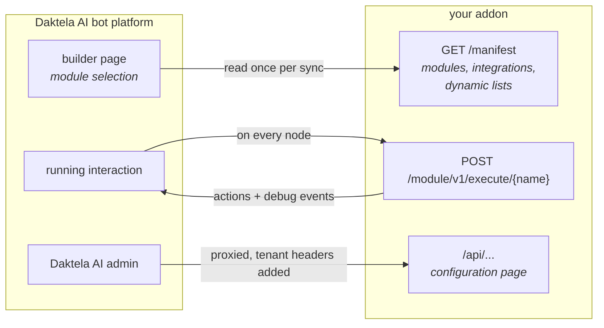

# 2. Project tour

Ten minutes of reading that will save you an afternoon of guessing.

## The mental model



Everything the platform knows about your addon comes from `GET /manifest`. Everything your addon does
at runtime happens because the platform called one of the generated `/module/v1/...`,
`/integration/v1/...` or `/dynamic_list/v1/...` endpoints.

You never write those endpoints. The SDK generates them by scanning three directories.

## Directory by directory

### `server/` — the addon

| Path | What it is |
|---|---|
| `main.py` | Process entry point. Ten lines. |
| `app.py` | **Read this first.** The whole wiring: addon identity, catalog registration, lifecycle hooks, health probes, static bundle. |
| `profile.py` | `basic` or `full` — whether this process has a configuration page. See below. |
| `identity.py` | Name, code, version, icon — what the platform shows. **Edit this when you fork.** |
| `di.py` | The dependency-injection container. Also the switch that decides whether settings live in memory or in Postgres. |
| `health.py` | The health response model, and why liveness and readiness differ. |
| `api/` | Your own HTTP API — the routes the configuration page calls. Tagged `frontend`. |
| `settings/` | The one storage abstraction (`SettingsStore`) and its two implementations. |
| `modules/catalog/` | **One file per module.** Scanned at startup. |
| `modules/executors/` | Plain helper classes the modules delegate to. Not scanned. |
| `integrations/catalog/` | **One file per integration.** Scanned at startup. |
| `dynamic_lists/catalog/` | **One file per dynamic list.** Scanned at startup. |

### `frontend/` — the UI the platform mounts

| Path | What it is |
|---|---|
| `src/mountConfiguration.tsx` | The entry point the platform calls: the settings page. |
| `src/main.tsx` | Standalone dev entry point. Not used by the platform. |
| `src/app/` | Routing and the app shell. `browserHash.ts` nests the addon's routes under the host's own hash route — read it before touching navigation. |
| `src/pages/` | The pages of the settings UI. |
| `src/api/` | The axios instance every call goes through. |
| the shared theme | `@coworkers/cw-utils` — the same Material UI theme the Daktela AI admin uses, applied in `src/components/AppLayout.tsx`. |
| `vite.config.ts` | Module Federation config — this is what produces `addonBundle.js`. |

### Everything else

| Path | What it is |
|---|---|
| `docs/` | This guide. |
| `unit_tests/` | Backend tests. Run with `make test`. |
| `migrations/`, `alembic.ini` | Database migrations. Inert until you enable persistence. |
| `docker-db/` | A Postgres for local development. Also optional. |
| `docker/` | Production image and compose file. |
| `.github/workflows/` | CI: lint, type-check, test. |

## Two profiles

One source tree, two shapes:

| | `basic` | `full` |
|---|---|---|
| Modules, integrations, dynamic lists | ✔ | ✔ |
| Settings store, `/liveness`, `/readiness`, `POST /api/register_addon` | ✔ | ✔ |
| `/api/example_credentials`, `/openapi-frontend.json`, `/dist` | — | ✔ |
| `GET /instance-configured` | — | ✔ |
| `has_setting` in the manifest | `false` | `true` |

`ADDON_PROFILE` picks one; `server/app.py` has a single `if is_full:` block, so everything the basic
image leaves out is visible in one place. `/liveness` reports which profile is running.

The missing route matters more than it looks: the platform **blocks activation** when
`/instance-configured` answers 409, and treats a 404 as "nothing to configure". An addon with no
configuration page could never clear a 409, so the basic profile must not register that route at all.

## The three catalogs

This is the single most important convention in the repository.

```
server/modules/catalog/hello_world.py          →  a node in the builder page
server/integrations/catalog/order_lookup.py    →  a tool the AI agent can call
server/dynamic_lists/catalog/example_list.py   →  a searchable select in the builder
```

Rules:

1. **One class per file.** Each file in a catalog directory must define exactly one subclass of
   `Module`, `Integration`, or `DynamicList`.
2. **No registration.** The SDK imports every `.py` file in the directory at startup. Adding a file
   is all it takes; deleting one removes the capability.
3. **The class attributes *are* the manifest.** `name`, `title`, `icon`, `input_attributes`,
   `output_ports` and friends are read straight off the class and published in `/manifest`.
4. **Restart to pick up changes.** With `--reload` that happens automatically; in bot-platform the
   addon also has to be re-synced ([chapter 5](05-module-in-the-builder.md)).

## The storage seam

The whole application depends on one Protocol, `server/settings/store.py`:

```python
class SettingsStore(Protocol):
    name: str
    async def get(self, tenant: TenantKey) -> ExampleCredentials | None: ...
    async def set(self, tenant: TenantKey, credentials: ExampleCredentials) -> ExampleCredentials: ...
    async def delete(self, tenant: TenantKey) -> None: ...
    async def health(self) -> None: ...
```

`server/di.py` picks the implementation at runtime: `JsonSettingsStore` by default, `SqlSettingsStore`
when the `db_*` environment variables are set. That is the entire "database optional" design — and
because `health()` lives on the store, it is also the only piece of infrastructure `/readiness` has to
ask about.

## Multi-tenancy, in one paragraph

One addon deployment serves many bot-platform instances. Every request carries `X-Customer` and
`X-Instance-Id` headers identifying which one, and the SDK turns them into `self.tenant` inside a
module and `TenantDep` inside your own routes. **Never** cache per-tenant data in a module-level
variable — always key it by `TenantKey(customer=..., instance_id=...)`.

## What you will actually edit

Building your own addon, in order:

1. `server/identity.py` — `code`, `name`, `description`, `author`, `fa_icon`, `color`.
2. `server/modules/catalog/` — delete the examples, add your own.
3. `server/settings/models.py` — replace `ExampleCredentials` with your own configuration fields.
4. `frontend/src/pages/ExampleSettingsPage.tsx` — the form for those fields.
5. `pyproject.toml` — the project name.

---

**Next:** [3. Connect to bot-platform](03-connect-to-bot-platform.md) — get your local addon talking
to the platform.
