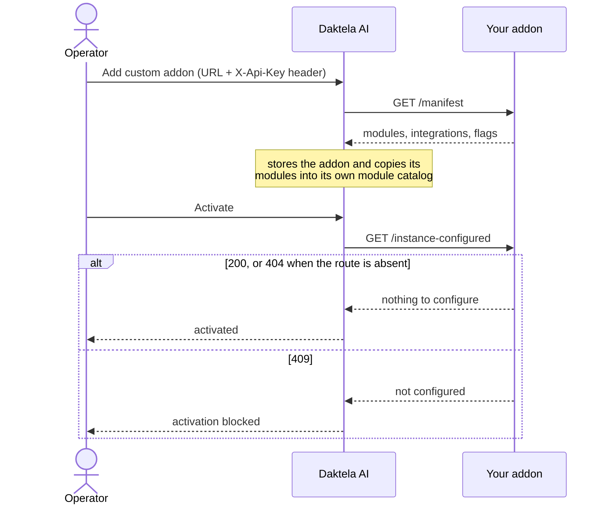

# 3. Connect the addon to Daktela AI

Your addon runs. Now make a Daktela AI instance aware of it, so your modules show up in the builder.

## What you need

- **A Daktela AI instance you can administer.** You do not run the platform yourself — it is hosted,
  and your addon talks to it over HTTP like any other integration.
- **Your addon reachable from that instance.** The platform fetches your manifest itself, so
  `http://localhost:8000` is not enough — a hosted platform cannot reach your laptop.

  **In production, the addon runs on a server** with its own address, deployed like any other
  service — see [chapter 13](13-deployment.md). There is no version of a production addon that
  points at somebody's `localhost`.

  **While developing**, a tunnel lets the platform reach the copy running on your machine, so you
  can edit with `--reload` and see the effect immediately:

  | Tool | Command | Account |
  |---|---|---|
  | [cloudflared](https://developers.cloudflare.com/cloudflare-one/connections/connect-networks/do-more-with-tunnels/trycloudflare/) | `cloudflared tunnel --url http://localhost:8000` | none for a quick tunnel |
  | [ngrok](https://ngrok.com/) | `ngrok http 8000` | free account |
  | [localtunnel](https://github.com/localtunnel/localtunnel) | `npx localtunnel --port 8000` | none |
  | [Tailscale Funnel](https://tailscale.com/kb/1223/funnel) | `tailscale funnel 8000` | Tailscale account |

  Each prints a public HTTPS URL. Register that below; it stays live while the tunnel runs.

  > **These are development tools. Never point a production instance at one.** A tunnel dies with
  > the terminal it runs in and takes the addon with it, a quick tunnel's URL changes on every
  > restart, and the traffic goes through a third party. Treat a tunnelled addon as a demo that
  > lives for an afternoon.

  Two things to watch even while developing: when the URL changes you have to update it in the
  platform, and anyone holding that URL can reach your addon — so set `API_KEYS` to something real
  rather than leaving it at `default`.

## How the platform finds addons

Two paths exist, and yours is the second:

| Path | How it works | Who uses it |
|---|---|---|
| **Catalog sync** | The platform polls a central addons catalog and imports what it lists. | First-party Daktela addons. |
| **Custom addon** | An operator pastes your addon's URL into the admin. The platform fetches `GET /manifest` from it and stores the result. | **You.** |

A custom addon is treated as third-party: it is never given the platform's shared API key, it cannot
claim a sidebar slot, and it can always be deactivated and removed. That is the right default, and
nothing in this guide needs more.

## Register it

1. Make sure your addon is running and reachable at that public URL.
2. In Daktela AI, open **Addons** and click **Add Custom Addon**.

   

3. Fill in:

   | Field | Value |
   |---|---|
   | Addon base URL | your public URL, e.g. `https://polished-river-1234.trycloudflare.com` |
   | Custom header key | `X-Api-Key` |
   | Custom header value | whatever you set `API_KEYS` to — `default` if you left it unset |

4. Click **Test**. The platform fetches `GET /manifest` with that header and tells you whether it
   worked — do this before saving.

   

   > The screenshot shows `http://localhost:8000`, which only works if the platform runs on the same
   > machine. Against a hosted instance, put your tunnel URL here instead.

5. Click **Save**, then **Activate** on the addon's card.

   

   A `basic` addon activates immediately. A `full` one answers `409` on `/instance-configured` until
   its configuration page has been filled in, and the platform refuses to activate it until then —
   open **Configure** first.

### Why the custom header is mandatory

This is the most common way to get stuck, so it is worth understanding.

Every addon endpoint is protected by `X-Api-Key`. When `API_KEYS` is unset, the SDK accepts exactly
one value — the literal string `default`.

For a **custom** addon the platform sends only the custom header you configured, and nothing at all if
you configured none: the platform's own shared key goes to first-party catalog addons, never to
yours. So without that header your addon answers `403 Could not validate API KEY` and the Test button
fails with no obvious explanation. Set it and it works.

In production, set `API_KEYS` to a real secret and use that as the custom header value — or use a
different header entirely (`Authorization: Bearer …`) and validate it yourself.

## What activation does

Concretely, the platform:

1. Fetches `GET /manifest` and stores it.
2. Copies every module from the manifest into its own module catalog — this is what puts them in the
   builder's module selection.
3. Calls `GET /instance-configured`. A `200` means "ready"; a `409` means "an operator still has to
   fill in the settings page"; a `404` means the addon does not implement the check, and is treated
   as ready.

This template answers `409` until something is saved on the settings page, and in the `basic` profile
does not implement the route at all — see [chapter 10](10-configuration-page.md) and
[chapter 13](13-deployment.md).

## Verify

- Your addon's log shows the manifest being fetched: `GET /manifest 200`.
- The addon appears in the Addons list as active.
- Opening a bot's builder page shows your modules in the module selection, grouped under the
  `category` you declared:

  

If the modules are not there yet, read [chapter 5](05-module-in-the-builder.md) — there is a sync
step, and a version rule that catches everyone once.

## Troubleshooting

| Symptom | Cause | Fix |
|---|---|---|
| Test fails, addon logs `403` | No custom header, or the wrong value | Set `X-Api-Key` / your `API_KEYS` value |
| Test fails, nothing in the addon log | The platform cannot reach the URL | It must be publicly reachable — a `localhost` URL never is. Check the tunnel is still up |
| Test fails on the certificate | Self-signed HTTPS | Use a tunnel that terminates TLS for you, or a real certificate |
| Test fails with a validation error | A malformed manifest | `curl -H "X-Api-Key: default" localhost:8000/manifest \| jq` and look for a module missing a required field |
| Saved, but no modules in the builder | The modules are not `public`, or their `version` did not change | See [chapter 5](05-module-in-the-builder.md) |
| Addon shows as "not configured" | `GET /instance-configured` answers 409 | Fill in the settings page, or run the `basic` profile |

---

**Next:** [4. Your first module](04-your-first-module.md) — the anatomy of a module.
