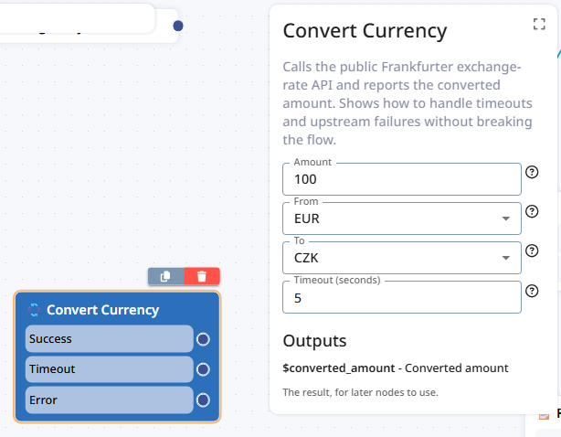

# 4. Your first module

A module is one node in the builder page. This chapter takes `server/modules/catalog/hello_world.py`
apart, then has you write your own.

## The shape

```python
class HelloWorldModule(Module[HelloWorldAttributes]):
    attributes: HelloWorldAttributes     # what the flow designer filled in

    name = "hello_world"                 # identity
    public = True                        # show it in the module selection
    title = LangString(en="Hello World", cs="Hello World")
    input_attributes = [...]             # the form in the builder
    output_ports = [...]                 # the arrows leaving the node

    async def execute(self) -> ModuleResponses:
        ...                              # what happens when the flow reaches it
```

Three things to internalise:

1. **The class attributes *are* the manifest.** There is no separate schema file. What you declare
   here is exactly what bot-platform reads from `GET /manifest` and renders in the builder.
2. **`execute()` is a pure-ish function of `(attributes, discussion, tenant)`.** It gets the
   flow designer's configuration and the conversation so far, and returns a list of actions. It does
   not mutate anything on the platform directly.
3. **The file's location is the registration.** Drop it in `server/modules/catalog/`, restart, done.

## What each declaration turns into

Before the field-by-field list, it helps to see where the pieces end up. This is
`server/modules/catalog/exchange_rate.py` as the flow designer sees it — the node on the canvas on
the left, its attribute panel on the right:



Everything in that picture comes from the class:

| In the module class | Where it shows up |
|---|---|
| `icon`, `title` | The node's icon and name, on the canvas and as the panel heading |
| `description` | The paragraph under the panel heading |
| `short_description` | The one-liner in the module selection ([chapter 5](05-module-in-the-builder.md)) |
| `category` | The group the module is listed under in the module selection |
| `input_attributes[].title` | Each field's label — *Amount*, *From*, *To*, *Timeout (seconds)* |
| `input_attributes[].description` | The **?** tooltip beside each field |
| `input_attributes[].default_value` | The prefilled value — `100`, `EUR`, `CZK`, `5` |
| `SelectAttribute.options` | Which values the dropdown offers |
| `output_ports[].title` | The rows with connection dots on the node — *Success*, *Timeout*, *Error* |
| `output_contexts[].name` | The variable name under **Outputs**, shown with a `$` prefix: `$converted_amount` |
| `output_contexts[].title`, `.description` | Its label and the sentence under it |

Two things worth noticing:

- **The order is yours.** Attributes and ports appear in the order you declare them, so declare them
  in the order a designer would read them.
- **Every string a designer sees is one you wrote.** They cannot open your code — a port called
  `error` with no description is a mystery arrow. Write the descriptions as if for someone who has
  never seen the addon, because that is who reads them.

## The manifest fields

| Field | Required | What it does |
|---|---|---|
| `name` | ✔ | Unique id within the addon. Bot-platform stores it in saved flows, so **renaming a published module orphans every flow that used it.** |
| `title` | ✔ | Node label in the builder. A `LangString(en=…, cs=…)`. |
| `icon` | ✔ | Emoji or a Font Awesome name. |
| `short_description` | ✔ | One line, shown in the module selection. |
| `description` | ✔ | Longer text, shown in the node's detail panel. |
| `category` | | The group your module appears under in the builder's module selection. Defaults to "Generic Modules". |
| `version` | | Free-form, e.g. `"v1"`. **Bump it whenever you change anything else on the class**, or the platform keeps serving the old definition — see [chapter 5](05-module-in-the-builder.md). |
| `public` | | **`False` by default.** A module that is not public never appears in the module selection. |
| `input_attributes` | | The form the flow designer fills in. See [reference/attributes.md](reference/attributes.md). |
| `output_ports` | | The arrows leaving the node. No ports means the flow stops here. |
| `output_contexts` | | Names of context variables the module promises to set, so later nodes can offer them. |
| `enabled_types` | | Restrict to `chatbot`, `voicebot`, `emailbot`, `rbm`. Empty means all. |
| `enabled_hosts` | | Restrict to specific platform hostnames. Useful for staging-only modules. |

## Attributes: the typed half and the declared half

```python
class HelloWorldAttributes(BaseModel):
    greeting: str                        # the typed half

input_attributes = [                     # the declared half
    StringAttribute(
        name="greeting",                 # must match the field above
        title=LangString(en="Greeting", cs="Pozdrav"),
        description=LangString(en="Text sent to the customer.", cs="..."),
        default_value="Hello!",
        required=True,
    ),
]
```

They serve different purposes:

- `input_attributes` is what the **builder** renders and what the **request schema** is generated
  from. It is the contract.
- `HelloWorldAttributes` is what **your editor and type-checker** see when you write
  `self.attributes.greeting`. It is a convenience.

Keep the names in sync. If they drift, the request validates fine and your attribute comes back as a
missing field — a confusing bug worth avoiding by keeping the two blocks next to each other.

The ten available attribute types are listed in [reference/attributes.md](reference/attributes.md).

## Output ports: how the flow continues

```python
output_ports = [
    OutputPortStatic(name="success", title=..., description=...),
    OutputPortStatic(name="error",   title=..., description=...),
]
```

Each port is an arrow the flow designer can wire to another node. Your `execute()` picks one:

```python
executor.add_output_port("success")
```

Give the designer an explicit failure path whenever your module can fail — see
`exchange_rate.py`, and [chapter 7](07-calling-external-apis.md). A flow that dead-ends because your
upstream API timed out is a bad customer experience and an unpleasant thing to debug.

> If the module raises instead, the SDK catches it, records the exception as an error-level debug
> event and takes a port named `other`. That is a safety net, not a design.

## `execute()`: two styles

**Small module — return `ModuleResponses` directly:**

```python
async def execute(self) -> ModuleResponses:
    return ModuleResponses(
        actions=[
            MessageAction(text=self.attributes.greeting),
            OutputPortAction(name="done"),
        ],
        sequence=self.discussion.sequence + 1,
    )
```

**Anything bigger — use `ModuleExecutor`:**

```python
async def execute(self) -> ModuleResponses:
    executor = ModuleExecutor(
        discussion=self.discussion,
        attributes=self.attributes,
        tenant=self.tenant,
        module_name=self.name,
    )

    executor.add_message("Hi!")
    executor.add_context("greeted", True)
    executor.add_output_port("done")

    return executor.get_response()
```

`ModuleExecutor` collects actions, folds all your `add_context` calls into a single action, appends
the debug entries and computes the next sequence number. The full list of helpers is in
[reference/actions.md](reference/actions.md).

## What the module can see

`self.discussion` is the conversation so far:

```python
self.discussion.get_last_customer_message()      # what the customer just said
self.discussion.get_conversation(limit=20)       # recent turns
self.discussion.get_context_value("order_id", str)
self.discussion.get_store_value("cart", dict)
self.discussion.language                         # "cs", "en", ...
```

`self.tenant` is which bot-platform instance is calling:

```python
self.tenant.customer        # environment identifier
self.tenant.instance_id     # the instance
self.tenant.bot_url         # its base URL
```

Use `(customer, instance_id)` whenever you store something per tenant — see
`tenant_settings.py`.

## Write your own

1. Create `server/modules/catalog/my_module.py`.
2. Copy the structure of `hello_world.py`. Change `name`, `title`, the attributes and `execute()`.
3. Save. With `--reload` the server restarts on its own.
4. Verify it is in the manifest:

```bash
curl -s -H "X-Api-Key: default" localhost:8000/manifest | jq '.modules[].name'
```

5. Call it directly, without a bot:

```bash
curl -X POST localhost:8000/module/v1/execute/my_module \
  -H "X-Api-Key: default" -H "X-Customer: local" -H "X-Bot-Url: https://your-instance.bot.daktela.com" \
  -H "X-Instance-Id: 1" -H "X-Instance-Name: local" \
  -H "Content-Type: application/json" \
  -d '{"attributes": {}, "discussion": {"messages": [], "sequence": 0}}'
```

6. Write a test for it — [chapter 12](12-testing.md) shows how, and it is faster than either of the
   two steps above.

## Common mistakes

| Mistake | Symptom |
|---|---|
| Forgot `public = True` | Module is in `/manifest` but not in the module selection |
| Two `Module` subclasses in one file | Startup error from the catalog loader |
| `input_attributes` name does not match the pydantic field | Attribute silently arrives empty |
| Renamed `name` after publishing | Existing flows lose the node |
| Changed the class without bumping `version` | The builder keeps showing the old form and ports |
| No `output_ports` | Flow stops at your node |
| Raising instead of taking an error port | Flow goes down `other`; the designer cannot react |

---

**Next:** [5. Using a module in the builder](05-module-in-the-builder.md) — getting it onto the canvas.
