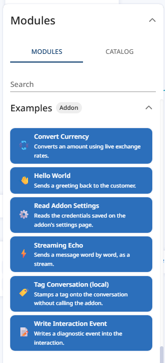
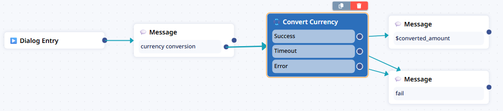

# 5. Using a module in the builder

Good news: **you do not write any platform code.** A module that is declared correctly and synced
appears in the builder's module selection by itself.

Three conditions have to hold:

1. The module is in `GET /manifest` — it is, if the file is in `server/modules/catalog/` and the
   addon restarted.
2. `public = True` on the module class.
3. The platform has re-synced the addon **since** you changed it — and for a module it already knows,
   that means its `version` changed. See below.

## Bump the version. Every time.

> **The platform updates an existing module only when its `version` changes.** Change a module's
> attributes, title, icon or output ports and leave `version` alone, and the sync runs, reports no
> error, and the builder keeps showing the **old** definition. Nothing warns you.

So the loop when editing a module the platform already knows is:

```python
class HelloWorldModule(Module[HelloWorldAttributes]):
    name = "hello_world"     # never changes - saved flows are bound to it
    version = "v2"           # bump whenever anything else in the class changes
```

then restart the addon and re-sync.

Two versions matter, and they are different things:

| Version | Where | What it gates |
|---|---|---|
| A module's `version` | on the `Module` class | Whether the platform updates that module's definition — attributes, ports, title, icon |
| The addon's `version` | `Settings(...)` in `server/app.py` | Appended to the configuration page's bundle URL, so bumping it busts the browser cache for your UI ([chapter 10](10-configuration-page.md)) |

Bumping the addon's `version` does **not** update a module whose own `version` stayed the same.

A change to a module's *behaviour* — the body of `execute()` — needs neither. Only the manifest is
cached; your code runs fresh on every call.

## Re-syncing

After adding a module or bumping a version:

- **Fastest:** in the Daktela AI admin, open **Addons** and click **Sync Addons**.
- **Or wait:** the platform re-syncs custom addons on a schedule (every ten minutes by default).

Restarting your addon is not enough on its own — the platform has to fetch the new manifest.

## Placing the module

1. Open a bot's builder page.
2. Find your module in the module selection. The `category` you declared is the group it appears
   under; the title and `short_description` are the ones from the manifest.

   

3. Drag it onto the canvas.
4. The attribute form on the right is generated from `input_attributes` — you did not write that
   form, and you cannot add custom controls to it. The ten attribute types
   ([reference](reference/attributes.md)) are all the builder renders.
5. Wire the output ports. Every `OutputPortStatic` you declared is one arrow.

Wired up, the three ports of `exchange_rate` look like this — success goes one
way, timeout and error another, and the next node reads the context variable
the module set:



`$converted_amount` in that message is the `OutputContext` the module
declared. That is the whole contract: ports decide *where* the flow goes,
contexts carry *what* it learned.

## Running it

1. Save the flow.
2. Open a test interaction for that bot.
3. Drive it until the flow reaches your module.
4. Your addon's log shows the execution:

```
INFO  Executing module hello_world ...
INFO  Module output response ...
```

Nothing in the log? The flow never reached the module, or the platform is talking to a different
addon URL than the one you are watching.

## Verify it actually ran

The log line above is on *your* side. To prove the platform received and applied the result, look at
the interaction's events — that is [chapter 6](06-events-in-interactions.md), and it is the check
worth learning properly.

## Two module-shaped things that are not modules

| You want | Use | Chapter |
|---|---|---|
| A node the designer wires into the flow | **Module** | this one |
| A function the AI agent calls on its own | **Integration** (`type: function`) | [8](08-integrations-and-tool-calls.md) |
| A searchable option list inside a module's form | **Dynamic list** | [9](09-dynamic-lists.md) |

## Troubleshooting

| Symptom | Cause | Fix |
|---|---|---|
| Module not in the module selection | `public` is `False` | Set `public = True`, restart, re-sync |
| Module not there, `public` is true | The platform has a stale manifest | Re-sync the addon |
| **Changed the module, the builder shows the old one** | Its `version` did not change | Bump the module's `version`, restart, re-sync |
| Not in `/manifest` either | The file is not in `server/modules/catalog/`, or the addon did not restart | Check the path; check the startup log for a catalog error |
| Two modules with the same name | The catalog keeps one | Rename one; names are unique per addon |
| The module appears but the form is empty | `input_attributes` is empty | That is valid — `tenant_settings` does it deliberately |
| The flow stops at your module | No `output_ports`, or `execute()` never took one | Declare a port and call `add_output_port` on every path |

---

**Next:** [6. Events in interactions](06-events-in-interactions.md) — how to prove your addon ran.
