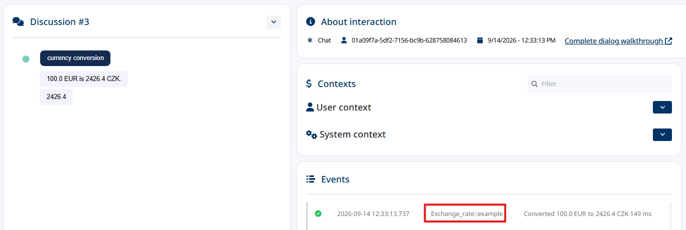

# 6. Writing events into an interaction

This is the chapter that answers *"is my addon actually working?"*

A conversation in bot-platform is called a **discussion**; in the Daktela AI admin its detail screen is
labelled **interaction**. Every interaction has an **Events** panel, and your addon can write into it.
That is the shortest reliable path from "my module ran" to "here is the proof, with a timestamp".

## The four things a module can leave behind

Only one of them is an event. Getting these straight saves a lot of confusion:

| Mechanism | Helper | Who sees it | Lives for |
|---|---|---|---|
| **Event** | `add_debug_info(message, debug_type)` | Operators and developers, in the Events panel | Forever, in `discussion_events` |
| **Message** | `add_message(text)` | The customer, in the chat | The conversation |
| **Context** | `add_context(key, value)` | Later nodes in the same flow | The flow run |
| **Store** | `add_store({...})` | Later nodes, across the whole conversation | The conversation |

`server/modules/catalog/interaction_event.py` does all four side by side so you can compare them.

## Writing an event

```python
from cw_addons.modules.models import DebugInfoType

executor.add_debug_info(
    message="Order 48271 not found in the CRM",
    debug_type=DebugInfoType.warning,     # info | warning | error
)
```

That is it. The entry ends up in `ModuleResponses.debug`:

```json
{
  "actions": [...],
  "debug": [{ "message": "Order 48271 not found in the CRM", "debug_type": "warning" }],
  "sequence": 4
}
```

## What the platform does with it

Each `DebugInfo` you return becomes one event row on the interaction, with `debug_type` mapped onto
the event's severity — so `error` entries stand out and can be filtered.

The platform also writes events of its own on this channel: if your addon times out, returns a
non-2xx, or raises, you get an `error` event without doing anything. **That means the Events panel is
also where you look when your module appears to do nothing at all.**

## Reading the events back

Three ways, in order of convenience:

**1. The Daktela AI admin.** Open the interaction and look at its **Events** panel. This is the one
you will actually use:



Each row shows the source as `<module>::<addon code>` — `Exchange_rate::example` above — along with
the message your module wrote and how long the execution took. Clicking a row shows the raw JSON.
That source is also the reason to set a real `ADDON_CODE` when you fork: it is what tells an operator
which addon produced the event.

**2. The API**, against your own instance:

```bash
curl -s "https://your-instance.bot.daktela.com/api/discussions/<discussionId>/events" \
  | jq '.[] | select(.type=="proxy_module")'
```

**3. Instance-wide.** `GET /api/<instanceId>/discussion-events` (and `.../grouped`) lists events
across every interaction on the instance — useful while testing, when you know your module ran but
not in which interaction.

## End-to-end check

This is the acceptance test for "my addon works":

1. Place the **Write Interaction Event** node in a flow, set the message to something unique
   (`probe-2026-09-12`), save.
2. Run a test conversation until the flow reaches it.
3. Open that interaction in the Daktela AI admin.
4. The Events panel contains a `proxy_module` entry with `probe-2026-09-12` and your module's name.

If step 4 fails, work backwards:

| Check | Command |
|---|---|
| Did the module run at all? | Your addon's log: `Executing module ...` |
| Did it return a debug entry? | Call the module directly (see below) and look at `debug` |
| Did the platform reach the addon? | Look for an `error` event in the same panel |

Calling the module directly:

```bash
curl -X POST localhost:8000/module/v1/execute/interaction_event \
  -H "X-Api-Key: default" -H "X-Customer: local" -H "X-Bot-Url: https://your-instance.bot.daktela.com" \
  -H "X-Instance-Id: 1" -H "X-Instance-Name: local" \
  -H "Content-Type: application/json" \
  -d '{"attributes": {"event_message": "probe", "severity": "warning"},
       "discussion": {"messages": [], "sequence": 0}}' | jq .debug
```

```json
[{ "message": "probe", "debug_type": "warning" }]
```

## What to write events about

Events are cheap, permanent and scoped to one conversation — which makes them the right tool for
things you will want to explain later:

- **Decisions:** "matched customer by phone number, confidence 0.82"
- **Upstream failures:** "CRM returned 503, falling back to the cached value"
- **Data problems:** "order id `48271` has no delivery address"
- **Boundaries:** what your addon received and what it sent onward

And the wrong tool for:

- High-volume debug tracing — use logs; events are stored per conversation forever.
- Anything the customer should see — use `add_message`.
- Values later nodes need — use `add_context` or `add_store`.
- Secrets. Events are visible to anyone with access to the conversation. Never write a token,
  password or full API response into one.

## Testing it without the platform

```python
async def test_module_writes_a_warning() -> None:
    module = InteractionEventModule(
        attributes=InteractionEventAttributes(event_message="order not found", severity="warning"),
        discussion=DiscussionBuilder().add_user_message("where is my order").build(),
        tenant=dummy_tenant,
    )

    response = await module.execute()

    assert response.debug[0].message == "order not found"
    assert response.debug[0].debug_type == "warning"
```

See `unit_tests/test_modules.py` and [chapter 12](12-testing.md).

---

**Next:** [7. Calling external APIs](07-calling-external-apis.md).
