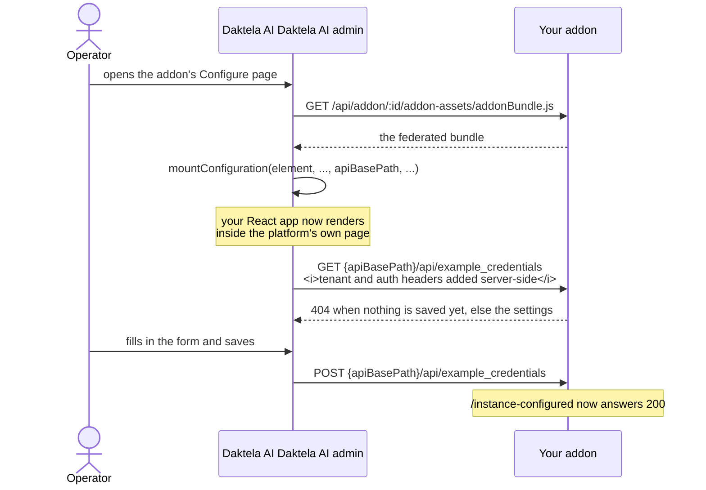

# 10. The configuration page

Your addon's own React UI, rendered inside bot-platform's admin interface. This is where an operator
enters the credentials your modules will use.

## How it gets on screen

```
frontend/ ──pnpm build──▶ dist/assets/addonBundle.js   (a Module Federation remote)
                                  │
        bot-platform loads it via /api/addon/:id/addon-assets/addonBundle.js
                                  │
     calls mountConfiguration(element, origin, instanceId, envType, apiBasePath, routerBasePath, hostContext)
                                  │
                          your React app renders into `element`
```

It is **not** an iframe. Your code runs on the platform's page, which means it loads fast and can
share styling — and also that it is trusted code, so keep your dependencies tidy.



## Three things the bundle must get right

These are not configurable preferences - get any of them wrong and the Daktela AI admin shows an error
instead of your page.

**1. The entry and its chunks live in `dist/assets/`, and reference each other relatively.**

The proxy maps `/api/addon/:id/addon-assets/<file>` to `<addon>/dist/assets/<file>` - a flat
mapping of one directory. So `dist/assets/addonBundle.js` must import `./chunk.js`, not
`./assets/chunk.js` and not `/assets/chunk.js`.

**Do not set `base` in `vite.config.ts`.** With `base: './'` the federation plugin emits chunk
imports relative to the build root, the platform then requests
`.../addon-assets/assets/chunk.js`, and you get:

```
Failed to fetch dynamically imported module:
http://.../api/addon/4/addon-assets/assets/__federation_expose_MountConfiguration-<hash>.js
```

`frontend/tests/federationBundle.test.ts` guards this. Run `pnpm build` before `pnpm test` so it
actually executes.

**2. Use `@originjs/vite-plugin-federation`, not `@module-federation/vite`.**

The host loads the remote with `@module-federation/runtime` and then calls what `loadRemote`
returned *as a function*:

```ts
const remoteModule = await loadRemote('dynamic/mountConfiguration')
const result = remoteModule?.(element, ...)
```

`@originjs` collapses a module whose only export is `default` down to that default, so the host gets
your function. `@module-federation/vite` returns the module namespace (`{ default: fn }`) and the
host dies with `remoteModule is not a function`.

**3. Export the mount function as the default export**, for the same reason.

## The mount function

```tsx
// frontend/src/mountConfiguration.tsx
const mountConfiguration = (element: HTMLElement, ...args: MountArgs): (() => void) => {
  const [platformOrigin, instanceId, , apiBasePath, routerBasePath, hostContext] = args

  const root = createRoot(element)
  root.render(<App platformOrigin={platformOrigin} instanceId={instanceId}
                   apiBasePath={apiBasePath} routerBasePath={routerBasePath} hostContext={hostContext} />)

  return () => root.unmount()
}
export default mountConfiguration
```

The platform decides the call shape, so leave the signature alone:

The call is **positional**: the platform passes plain values with no names attached, so the order and
count are the contract and the names below are this template's own. Older addons spell arguments 2–5
`cwUrl` / `cwInstanceId` / `cwNamespace` / `cwBasePath` — same positions, same values.

| # | Argument | |
|---|---|---|
| 1 | `element` | Where to render |
| 2 | `platformOrigin` | The platform's origin |
| 3 | `instanceId` | Which instance |
| 4 | `environmentType` | The host's environment type |
| 5 | `apiBasePath` | **The API prefix** - see below |
| 6 | `routerBasePath` | The path the Daktela AI admin has the addon under |
| 7 | `hostContext` | Host data: languages, dialogs, the Daktela AI admin language |

**Return an unmount function.** The platform calls it when it tears the addon down - navigating
away, switching instance. Without it the React root leaks and event listeners survive.

`hostContext` is how the contract grows: new host data arrives as a new optional field on that
object, never as an eighth positional argument, so older bundles keep working. Treat every field as
possibly absent - when you run standalone, the whole object is.

### `apiBasePath`, the argument you must not ignore

It is the prefix your API calls have to go through, something like `/api/addon/12/proxy`. Requests sent there are proxied to your addon with the tenant headers
(`X-Customer`, `X-Bot-Url`, `X-Instance-Id`, `X-Instance-Name`) and your auth header injected
server-side. The browser never sees your addon's URL or credentials.

```ts
// frontend/src/api/axiosInstance.ts
export const configureAddonApi = (basePath?: string) => {
  addonAxios.defaults.baseURL = basePath ?? ''
}
```

Every call goes through `addonAxios`. Use it (or the Orval-generated client) and never a bare
`fetch`, or your requests will bypass the proxy and fail.

## Looking like part of the platform

Your page renders inside the Daktela AI admin, so it should not look like a different product. Use
the shared Material UI theme:

```tsx
import { theme } from '@coworkers/cw-utils'
import { ScopedCssBaseline, ThemeProvider } from '@mui/material'

<ThemeProvider theme={theme}>
  <ScopedCssBaseline sx={{ bgcolor: 'background.default' }}>{children}</ScopedCssBaseline>
</ThemeProvider>
```

That is the same theme the admin itself and Daktela's own addons render with: the Daktela palette,
Noto Sans, and component styling for buttons, cards and data grids. It is published to a registry
that is readable **anonymously** (`frontend/.npmrc`), so you need no account to build against it.

Three things worth knowing:

- **`ScopedCssBaseline`, not `CssBaseline`.** Your page lives inside the platform's own document; a
  global baseline would reset the host's styles along with yours.
- **It does not resize MUI's heading variants.** `variant="h1"` is still MUI's 96px. Use a semantic
  element with a sensible variant — `<Typography variant="h5" component="h1">` — as the pages in
  this template do.
- **Fonts.** The theme asks for Noto Sans. Mounted in the admin, the host already provides it;
  running standalone nothing would, so `src/main.tsx` — the standalone entry point only — imports
  `@fontsource/noto-sans`.

The theme's peer range caps MUI at `^7` (and `@mui/x-data-grid` at `^8`), so those packages stay
there until it widens — see CONTRIBUTING.md.

The package also exports `themeBase` (an untouched MUI theme) and `fontWeights`. To extend rather
than replace:

```tsx
import { theme } from '@coworkers/cw-utils'
import { createTheme } from '@mui/material/styles'

const addonTheme = createTheme(theme, {
  components: { MuiCard: { styleOverrides: { root: { borderRadius: 12 } } } },
})
```

Extend it sparingly. The point of the shared theme is that every addon looks like the same product.

## Routing: you are a guest in someone else's URL

The Daktela AI admin is itself a hash router. When it mounts your addon the browser is at something like

```
https://platform.example.com/#/instance/5/addons
```

and that prefix arrives as the sixth argument, `routerBasePath`. **Your routes nest under it:**

| Your local route | What is actually in the URL |
|---|---|
| `#/getting-started` | `#/instance/5/addons/getting-started` |
| `#/settings` | `#/instance/5/addons/settings` |

Two rules follow, and breaking either makes your menu look dead — clicking it navigates the host away
from the page your addon is mounted on, so the addon unmounts:

1. **Never assign to `location.hash`.** That replaces the host's route with yours. Use
   `history.pushState` / `replaceState` and keep `pathname` and `search` intact.
2. **Never read `location.hash` directly.** Strip the prefix off first, so the rest of your app only
   deals in local hashes.

`frontend/src/app/browserHash.ts` does both. Call `configureRouterBasePath(routerBasePath)` once,
then use `getLocationHash`, `pushHash`, `replaceHash`, `toNavigationHref` and
`addHashChangeListener` and never touch `location` yourself.

```tsx
const navigate = (next: AppRoute) => {
  // State first, then the URL: pushState does not fire `hashchange`, so the
  // listener will not do it for you.
  setRoute(next)
  pushHash(next.hash)
}
```

Keep the `hashchange` subscription too — that is what makes the browser's back button work, and it
is how you notice the host moving somewhere else.

Standalone (`pnpm dev`) there is no prefix and all of this is a pass-through, which is exactly why
this bug does not show up until you load the addon inside the platform.
`frontend/tests/browserHash.test.ts` covers both modes.

## The backend side

`server/api/example_credentials.py` holds the three routes the page calls:

```python
api_router = APIRouter(prefix="/api", tags=["frontend"])

@api_router.get("/example_credentials", operation_id="getExampleCredentials")
async def get_example_credentials(tenant: TenantDep, store: SettingsStoreDep) -> ExampleCredentials: ...
```

Two conventions to keep:

- **`tags=["frontend"]`.** `GET /openapi-frontend.json` exposes only these routes, and that filtered
  schema is what the TypeScript client is generated from. It keeps the platform-facing routes
  (`/manifest`, `/module/v1/...`) out of your frontend types.
- **`TenantDep`.** It validates `X-Api-Key` and turns the tenant headers into a `Tenant`. Everything
  you store must be keyed by `(customer, instance_id)` — one addon deployment serves many instances.

## Generating the typed client

```bash
make backend     # in one terminal
make orval       # in another
```

Orval reads `http://localhost:8000/openapi-frontend.json` and writes React Query hooks, axios calls
and zod schemas into `frontend/src/gen/`. That directory is git-ignored: regenerate it rather than
committing it, so it can never drift from the backend.

The example settings page uses plain `addonAxios` and a hand-written zod schema, so the template works
before you have generated anything. Once you have your own routes, switch the page over to the
generated hooks — they are typed against the real schema.

## `/instance-configured` and `/api/register_addon`

```python
LifecycleService.register(app, on_register_addon=_register_addon, on_check_configured=_check_configured)
```

| Route | Called when | This template answers |
|---|---|---|
| `GET /instance-configured` | The operator activates the addon, and afterwards | `200` if the instance has credentials stored, `409` if not |
| `POST /api/register_addon` | After the platform syncs the addon | `{"success": true}`, and logs the config keys |

`_register_addon` is where a real addon seeds settings from the platform's environment configuration:

```python
await store.set(
    TenantKey(customer=context.customer, instance_id=context.instance_id),
    ExampleCredentials(**request.env_config),
)
```

This template only logs, so registering can never overwrite something an operator typed in by hand.

Supplying no callback is also valid — the SDK simply does not register that route, and the platform
tolerates the 404.

## Developing without the platform

```bash
make backend
make frontend      # http://localhost:5173
```

`vite.config.ts` proxies `/api` to the backend and injects the headers the platform would normally
add:

```ts
proxy: {
  '/api': {
    target: `http://localhost:${backendPort}`,
    headers: {
      'X-Api-Key': 'default',
      'X-Customer': 'local-dev',
      'X-Bot-Url': 'https://your-instance.bot.daktela.com',
      'X-Instance-Id': '1',
      'X-Instance-Name': 'local-dev',
    },
  },
}
```

So you get the real API with a fake tenant. Change `X-Instance-Id` to check that your tenant scoping
actually works.

## Serving the built bundle

`server/app.py` mounts `frontend/dist` at `/dist` when the directory exists:

```python
if FRONTEND_DIST.is_dir():
    app.mount("/dist", StaticFiles(directory=FRONTEND_DIST, html=True), name="frontend")
```

The guard is deliberate: the backend starts fine before you have ever built the frontend. In
production the Docker image builds the bundle first — see [chapter 13](13-deployment.md).

Verify:

```bash
curl -I localhost:8000/dist/assets/addonBundle.js     # 200
```

## Troubleshooting

| Symptom | Cause | Fix |
|---|---|---|
| Blank page inside the platform | The bundle failed to load | Check `/dist/assets/addonBundle.js` returns 200 on the addon's public URL |
| `Failed to fetch dynamically imported module .../addon-assets/assets/...` | Chunk paths are relative to the build root | Remove `base` from `vite.config.ts`, rebuild |
| `remoteModule is not a function` | Built with `@module-federation/vite`, or the mount is not the default export | Use `@originjs/vite-plugin-federation` and `export default` |
| Every API call 404s | A bare `fetch`, or a hard-coded URL | Route everything through `addonAxios` so `apiBasePath` applies |
| API calls 403 | The auth header is missing | Custom addons: set the custom header in the Daktela AI admin ([chapter 3](03-connect-to-bot-platform.md)) |
| API calls 422 | Tenant headers missing | Standalone dev: check the proxy headers in `vite.config.ts` |
| Saving works, addon still "not configured" | `_check_configured` reads a different key than the route writes | Both must use `TenantKey(customer, instance_id)` |
| Navigating breaks the Daktela AI admin | Path-based routing | Use hashes |

---

**Next:** [11. Persistence](11-persistence.md).
