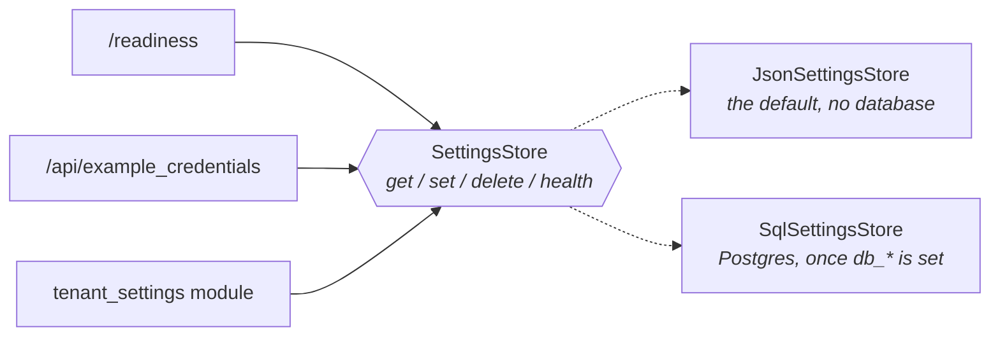

# 11. Persistence

The addon runs with no database. When you need one, it is four commands away.

## Why it is optional

The template stores exactly one thing: each tenant's settings. That goes through a single Protocol:

```python
# server/settings/store.py
class SettingsStore(Protocol):
    name: str
    async def get(self, tenant: TenantKey) -> ExampleCredentials | None: ...
    async def set(self, tenant: TenantKey, credentials: ExampleCredentials) -> ExampleCredentials: ...
    async def delete(self, tenant: TenantKey) -> None: ...
    async def health(self) -> None: ...
```



Two implementations ship:

| | `JsonSettingsStore` (default) | `SqlSettingsStore` |
|---|---|---|
| Needs | nothing | Postgres |
| Survives a restart | only with `ADDON_SETTINGS_FILE` | yes |
| Shared between replicas | no | yes |
| Good for | development, single-replica deployments | production |

`server/di.py` picks one at runtime, and because `providers.Selector` is lazy, the Postgres branch is
never even constructed in JSON mode.

## Turning Postgres on

```bash
# 1. start the development database
docker compose -f docker-db/docker-compose.yaml up -d      # or: make db-up

# 2. tell the addon about it
cp .env.example .env                # then uncomment the db_* block

# 3. create the table
uv run alembic upgrade head         # or: make migrate

# 4. run
uv run uvicorn server.main:app --reload
```

Verify:

```bash
curl localhost:8000/readiness
# {"status":"healthy","backend":"postgres"}      <- it said "json" before step 2
```

Settings saved on the configuration page now survive a restart.

To go back: comment the `db_*` block out again. Nothing else changes.

The bundled database listens on **port 5442**, not 5432, so it does not fight with a Postgres you may
already run. The credentials in `docker-db/docker-compose.yaml`, `.env.example` and the fallback in
`migrations/env.py` all match.

## How the switch works

```python
def storage_backend() -> str:
    explicit = os.getenv("SETTINGS_STORE")
    if explicit:
        return explicit
    return "postgres" if DBConnectionSettings().is_valid() else "json"
```

`DBConnectionSettings` (from `cw_utils`) reads the `db_` prefixed variables: `db_host`, `db_port`,
`db_name`, `db_username`, `db_password`. All five must be present. `SETTINGS_STORE=json|postgres`
overrides the detection, which is handy in tests and in a container where the variables come from
somewhere you do not control.

## Changing the stored data

`ExampleCredentials` is the source of truth for the payload; `ExampleCredentialsRow` is its table.
Change both, then generate a migration:

```bash
make migrate-generate m="add webhook_secret"
make migrate
```

Keep the table **dialect-neutral** — no JSONB, no ARRAY, no `postgresql_*` keyword arguments. The test
suite creates it on SQLite so CI can exercise the SQL store without a database server; a
Postgres-specific column breaks that.

## Storing more than settings

The template has one table because it needs one. For your own tables:

1. Add the SQLModel class to `server/settings/sql_table.py` (or a new module imported by
   `migrations/env.py`).
2. Generate and apply a migration.
3. Give each new concern its own small store class, following the same protocol-plus-implementations
   shape. Resist adding a repository layer and a service layer on top — `set()` is already an upsert.

Whatever you store, key it by `(customer, instance_id)`. Data belonging to one tenant must never be
reachable from another.

## Health checks

```python
async def _liveness() -> HealthResponse:
    return HealthResponse(status="alive")          # touches nothing
```

```python
async def _readiness(store: SettingsStoreDep) -> JSONResponse:
    await store.health()                           # SELECT 1 in postgres mode, a no-op in json mode
```

The split is deliberate. If liveness depended on the database, a brief outage would make Kubernetes
restart every healthy replica and turn a small problem into a large one. Readiness is the probe that
should fail: the pod stops receiving traffic and starts again when the database comes back.

Point your orchestrator's liveness probe at `/liveness` and its readiness probe at `/readiness`.

## Two behaviours worth knowing

- **`CWSessionPool` shuts the process down** after 30 consecutive failed sessions
  (`os.kill(os.getpid(), SIGTERM)`). It is intentional: a pod that cannot reach the database is more
  useful dead and restarted than alive and failing. Surprising the first time you see it in a log.
- **On Windows**, `psycopg`'s async driver cannot run on the default Proactor event loop.
  `server/main.py` and `migrations/env.py` both set the selector policy before anything else:

  ```python
  if sys.platform == "win32":
      asyncio.set_event_loop_policy(asyncio.WindowsSelectorEventLoopPolicy())
  ```

  Without it the first query fails with a confusing `InterfaceError`.

## Testing both modes

`unit_tests/conftest.py` parametrizes the `store` fixture, so every store and route test runs twice —
once against the JSON store, once against SQLite:

```python
@pytest.fixture(params=["json", "postgres"])
async def store(request, tmp_path):
    if request.param == "json":
        yield JsonSettingsStore(path=tmp_path / "settings.json")
        return

    pool = CWSessionPool(default_connection_string="sqlite+aiosqlite:///:memory:")
    async with pool.engine.begin() as connection:
        await connection.run_sync(sql_table.metadata.create_all)
    yield SqlSettingsStore(provider_session_factory(pool))
```

`unit_tests/test_settings_store.py` is the specification of the protocol. Writing a third
implementation? Make it pass that file.

The tables there are created from the model metadata, not by running Alembic, so the suite does not
prove the migrations are correct. `.github/workflows/migrations.yml` does that against real Postgres
with `alembic check` — it is scheduled rather than on every push.

---

**Next:** [12. Testing](12-testing.md).
