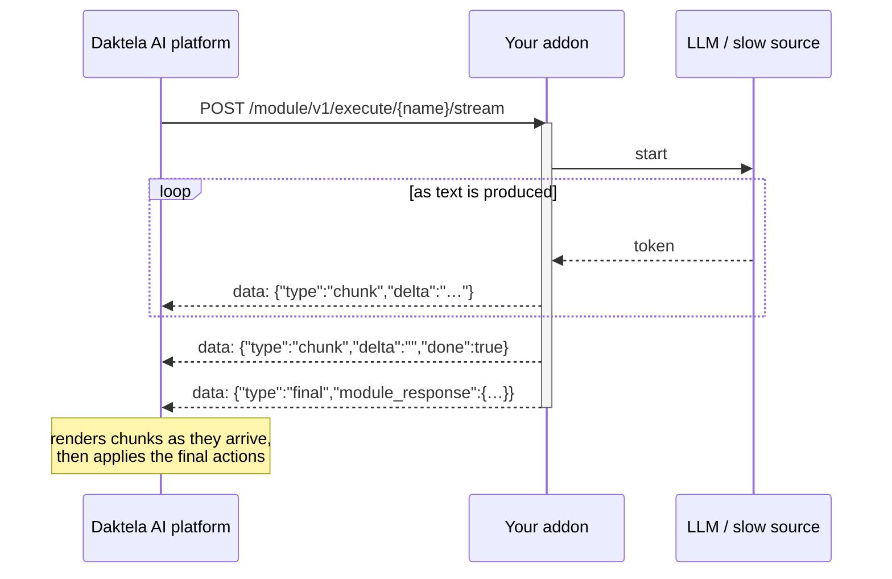
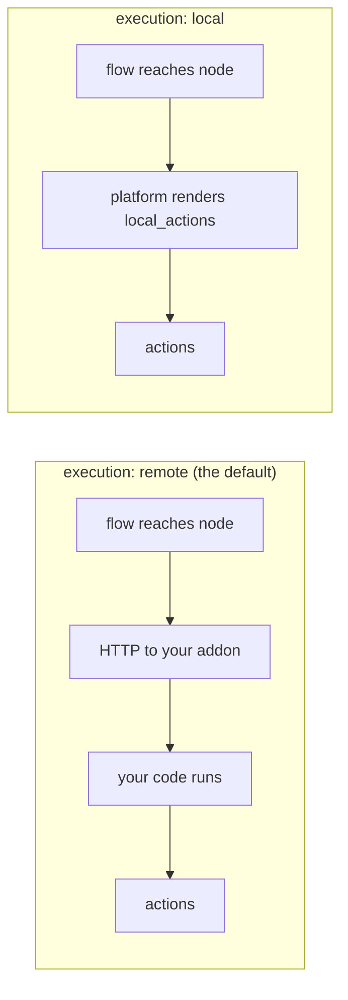

# 14. Advanced: streaming and local modules

Two capabilities most addons never need. Read the rest of the guide first —
neither of these makes a module better on its own.

---

## Streaming

A normal module answers once, when it is done. If that takes five seconds, the customer watches a
typing indicator for five seconds. A streaming module sends its answer as it produces it, so text
appears the way a person types it. In practice that means one thing: an LLM call.

Worked example: `server/modules/catalog/streaming_echo.py`.

### Opting in

Define `execute_streamed`. That is the whole opt-in — there is no flag:

```python
async def execute_streamed(self) -> AsyncIterator[StreamEnvelope]:
    ...
```

The SDK checks for the method (`hasattr`), sets `supports_streaming: true` in the manifest, and
registers `POST /module/v1/execute/{name}/stream` next to the ordinary endpoint.

> Because the check is `hasattr` on the class, defining `execute_streamed` on a shared base class
> silently turns streaming on for every module that inherits from it.

### The wire format

Server-Sent Events. Each frame is `data: <json>\n\n`, and the JSON is one of three envelopes from
`cw_addons.modules.streaming`:

| Envelope | Fields | When |
|---|---|---|
| `ChunkEvent` | `delta: str`, `done: bool = False` | Zero or more, as text is produced |
| `FinalEvent` | `module_response: ModuleResponses` | Exactly once, last |
| `ErrorEvent` | `message: str`, `error_type: str` | Instead of the final event, if something raised |



### The rule that matters

**The chunks and the final response are two representations of the same answer, not two halves of
it.** `FinalEvent.module_response` is a complete, ordinary `ModuleResponses` — the same one
`execute()` would have returned, with the full message text, the output port, contexts, store and
debug entries.

So a client:

1. renders each `delta` as it arrives, concatenating them, and
2. takes everything else — which port the flow follows, context and store writes, debug events —
   from the final event,
3. and does **not** append the final message text to what it already showed.

Get this wrong and the customer sees the answer twice.

`unit_tests/test_streaming.py` pins this down, including
`test_the_streaming_and_plain_paths_agree` — the two code paths are the thing that drifts.

### `execute()` is still required

It is abstract on the base class, the plain route is always registered, and the platform falls back
to it whenever it is not streaming this call. Keep both paths producing the same answer; the example
has them share one `_build_response()`.

### Errors

If `execute_streamed` raises, the SDK catches it, emits a single `ErrorEvent` and closes the stream —
no final event follows:

```json
data: {"type":"error","message":"connection timed out","error_type":"ConnectTimeout"}
```

Anything you can handle gracefully, handle inside the generator and yield a normal `FinalEvent`
instead, so the flow designer's error port still works. An `ErrorEvent` is the last resort.

### Try it

```bash
curl -N -X POST localhost:8000/module/v1/execute/streaming_echo/stream \
  -H "X-Api-Key: default" -H "X-Customer: local" -H "X-Bot-Url: https://your-instance.bot.daktela.com" \
  -H "X-Instance-Id: 1" -H "X-Instance-Name: local" \
  -H "Accept: text/event-stream" -H "Content-Type: application/json" \
  -d '{"attributes": {"text": "this arrives one word at a time", "delay_ms": 200},
       "discussion": {"messages": [], "sequence": 0}}'
```

`-N` matters: without it curl buffers the body until the connection closes and you see nothing
stream.

### Things that will bite you

- **Proxies buffer.** The SDK sets `Cache-Control: no-cache, no-transform`, `Connection: keep-alive`
  and `X-Accel-Buffering: no`, but an ingress that re-compresses responses will still hold them.
  If your stream arrives all at once in production and streams fine locally, look there first.
- **No cancellation.** Nothing cancels your work if the client disconnects mid-stream. If your module
  spends money per token, handle that yourself.
- **The envelope vocabulary is small on purpose.** `chunk`, `final`, `error` — that is all. Ignore
  unknown `type` values for forward compatibility.

---

## Local modules

The opposite trade. A **local** module declares what it wants done in the manifest and the platform
carries it out itself — no request ever reaches your addon.

Worked example: `server/modules/catalog/local_tag.py`.

```python
class LocalTagModule(LocalModule[LocalTagAttributes]):
    local_actions = [
        LocalContextAction(name="conversation_tag", value="{tag}"),
        LocalSenderMetadataAction(key="tagged_by", value="{source}"),
    ]
```

`{tag}` and `{source}` are substituted from the node's own attributes. `LocalModule` sets
`execution = "local"` for you.



**What you get:** no round trip, so the node is instant, and it keeps working while your addon is
down or being redeployed.

**What you give up:** everything else. No HTTP calls, no database, no branching, no computation — a
local module can set context variables and sender metadata from its own attributes, and nothing more.
It must declare **exactly one** `OutputPortStatic`; with no code running there is nothing to branch
on, and `to_manifest()` raises if you declare more.

Worth it for the small stateless nodes that would otherwise pay a round trip to do nothing: tagging
an interaction, stamping a constant, copying an attribute into a context variable. For anything else,
use a normal module.

### Local modules and dynamic lists go together

This is the combination that makes local modules worth having. A
[dynamic list](09-dynamic-lists.md) lets the flow designer *pick* something real from your system —
a queue, a department, an agent, a product category — and a local module then writes that choice into
the interaction without a round trip:

```python
input_attributes = [
    DynamicListAttribute(
        name="queue_list",              # backed by your DynamicList of the same name
        title=LangString(en="Queue", cs="Fronta"),
        description=LangString(en="Which queue this belongs to.", cs="Do které fronty to patří."),
        required=True,
    ),
]

local_actions = [
    LocalContextAction(name="queue", value="{queue_list}"),
]
```

The dynamic list runs on your addon, but only at **design time**, while somebody is building the
flow. At **run time** the node is pure platform: no call, no latency, and it keeps working when your
addon is down. You get a searchable, always-current picker and a node that costs nothing to run.

The plain `/module/v1/execute/{name}` route still exists for a local module — older platforms that do
not understand the flag call it, and the SDK's default `execute()` renders the same result. Do not
override it.

---

**Next:** [Reference](reference/) and [Troubleshooting](troubleshooting.md).
